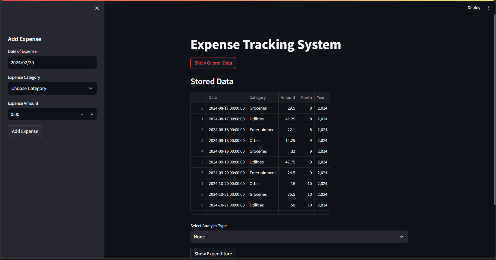
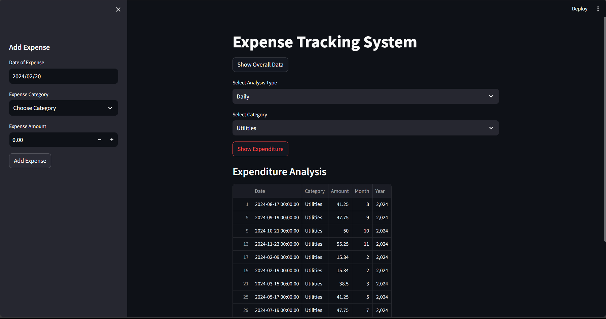
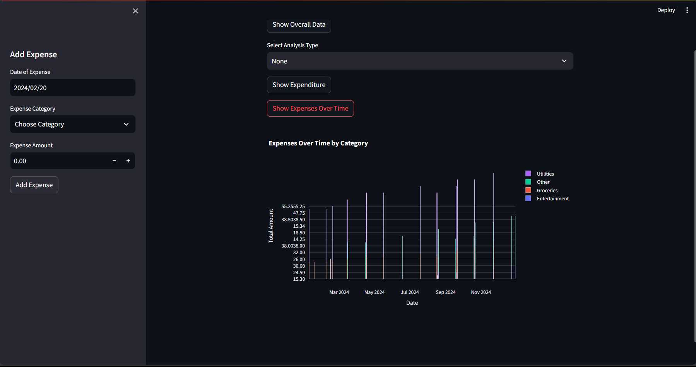
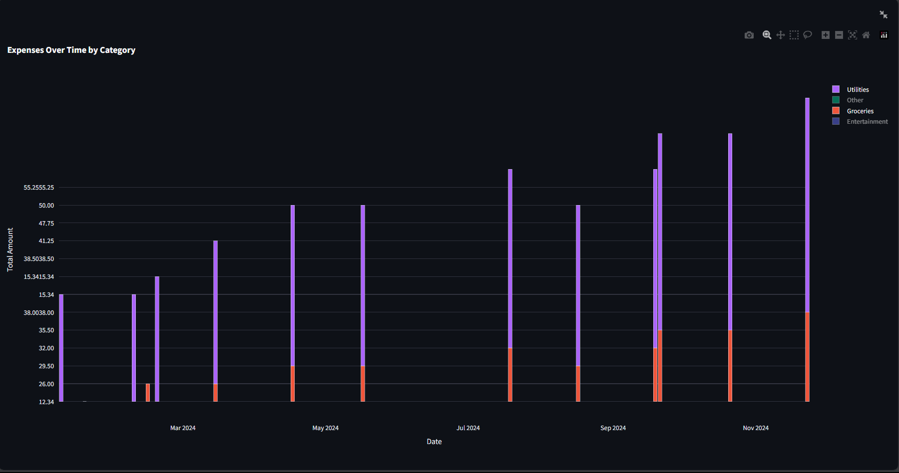
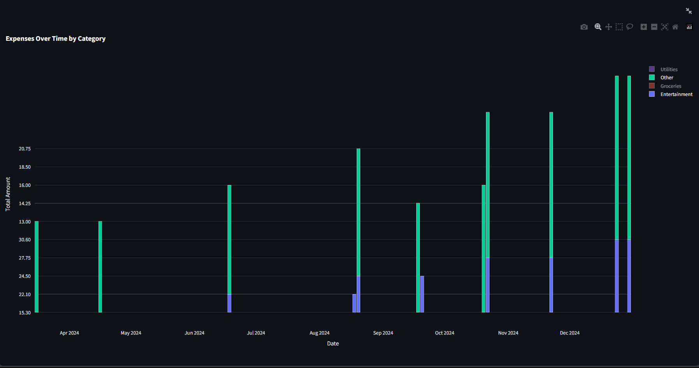

# Expense Tracking System

Expense Tracking System is a Streamlit web application that allows users to track their expenses and analyze spending patterns over time.

## Prerequisites

1. Python 3.8
2. Streamlit 1.31.1 
3. Plotly 5.19.0

## Functionality

1. Add Expense: Users can add new expenses by entering the date, category, and amount.
2. View Overall Data: Users can view all stored expense data in a tabular format.
3. Expenditure Analysis: Users can analyze their expenses by selecting an analysis type (Daily, Monthly, or Yearly) and optionally choosing a specific category. The application provides total expenditure for each selected analysis type.
4. Expenses Over Time: Users can visualize their expenses over time using interactive bar charts.

## Screenshots

## License

This project is licensed under the [MIT](https://choosealicense.com/licenses/mit/) License